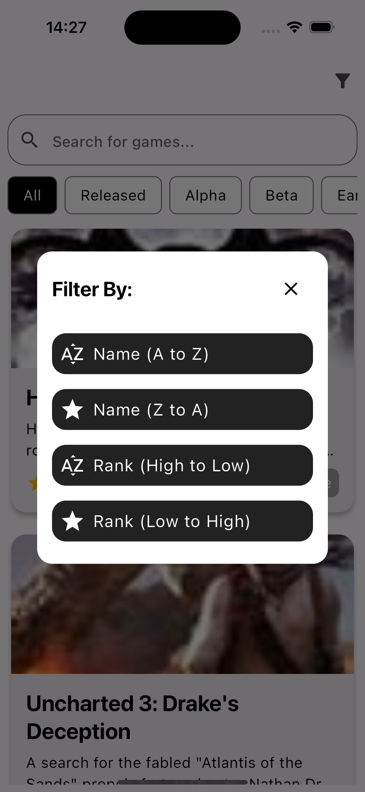

# IGDB Games

 <h3>
  This application allows you to view games and screenshots from the IGDB API.
  </h3>

## Functionality

<table>
  <tr>
    <td><h3>Load as your scroll<h3></td>
     <td><h3>Find all available game modes<h3></td>
  </tr>
  <tr>
    <td></td>
    <td></td>
  </tr>
 </table>

 <table>
  <tr>
     <td><h3>Filter games<h3></td>
     <td><h3>Search for your favorite games<h3></td>
     <td><h3>View screenshots of your favorite games<h3></td>
      
  </tr>
  <tr>
    <td></td>
    <td></td>
    <td></td>
    
  </tr>
 </table>

  <table>
  <tr>
     <td><h3>Read the summary and storyline<h3></td>
     <td><h3>Search by the game status<h3></td>
  </tr>
  <tr>
    <td></td>
    <td></td>
  </tr>
 </table>


## Built With

This project is built with Flutter.

A few resources to get you started if this is your first Flutter project:

- [Lab: Write your first Flutter app](https://flutter.dev/docs/get-started/codelab)
- [Cookbook: Useful Flutter samples](https://flutter.dev/docs/cookbook)

For help getting started with Flutter, view our
[online documentation](https://flutter.dev/docs), which offers tutorials,
samples, guidance on mobile development, and a full API reference.


## Getting Started

To get a local copy up and running follow these simple steps.

### Prerequisites

Follow the steps on [flutter dev](https://flutter.dev/) to install the Flutter SDK

### Installation

1. Clone the repo
   ```sh
   git clone [repo]
   ```
2. Install packages
   ```sh
   flutter packages get
   ```
3. Go to [IGDB](https://api-docs.igdb.com/#getting-started) to get your keys
   
4. Create a Constants.dart files with the following:
   ```dart
    class Constants {
      static const clientId = '<Your Client-ID>';
      static const token = '<Your Token>';
    }
    ```

### Running tests

Tests can be executed  with the following command:

```sh
flutter test
```

## Android Screenshots

<table>
  <tr>
    <td><h3>Searching<h3></td>
     <td><h3>Game Status<h3></td>
     <td><h3>Detail Page<h3></td>
  </tr>
  <tr>
    <td></td>
    <td></td>
    <td></td>
  </tr>
 </table>

 <table>
  <tr>
    <td><h3>Filter<h3></td>
     <td><h3>Game Modes<h3></td>
     <td><h3>Game Screenshots<h3></td>
  </tr>
  <tr>
    <td></td>
    <td></td>
    <td></td>
  </tr>
 </table>